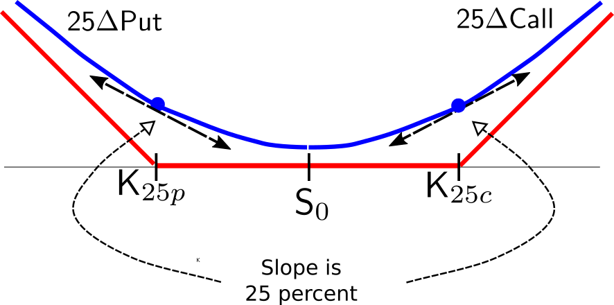
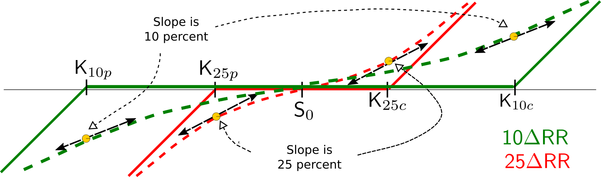

# A modicum of option pricing theory

Through her non-technical analysis, Payne had gained a deeper understanding of the economic intuition of the pricing rationale of FX options and their information content. But she had already reached the stage where some basic option mathematics was necessary to understand how best to squeeze the information out of currency options. 

Pairing her Amazon Prime account with the newly acquired Alexa Amazon device, bought at a bargain Black Friday price, she ordered some derivatives books enjoying 2-day free delivery.^[-@Wilmott2006 and -@Hull2017.] When the books arrived, she started reading them and taking notes. Let's take a discrete peek at these notes.


## The $\Delta$ of an option

The first concept requiring clarification is the $\Delta$ of an option. Simply speaking, the $\Delta$ of an option measures the sensitivity of the instrument to changes in the value of the underlying, $S$. For a call option, with price denoted as $C$, its $\Delta$ is:

\[ \Delta_C = \frac{\partial C}{\partial S}.\]

Similarly, for a put the $\Delta$ is:

\[ \Delta_P = \frac{\partial P}{\partial S}.\]

Note that the $\Delta$ of a put is always negative. Hence, attention should be paid when looking at option structures. In a risk reversal, there is a short put. Hence, the $\Delta$ of this put is positive. In the strangle, there is a long put position and the $\Delta$ is negative. But the strike prices of these puts will always be referred to as $XY\Delta$, where $XY$ is the absolute value of the $\Delta$ of the put option.

Armed with this knowledge, it is straightforward to link the $\Delta$s in the risk reversal to their corresponding strike prices:

\
```{r echo=FALSE, out.width="60%", fig.cap="25$\\Delta$ risk reversal"}

```
\

as well as in the strangle:

\
```{r echo=FALSE, out.width="60%", fig.cap="25$\\Delta$ strangle"}

```
\

and to figure out the strike points for different $\Delta$s in a single type of instrument:

\
```{r echo=FALSE, out.width="80%", fig.cap="10$\\Delta$ and 25$\\Delta$ risk reversals"}

```
\

The 10$\Delta$ strike points are way more out-of-the money than the 25$\Delta$ strike points. The quotes of the former can better capture tail movements of the exchange rate. On the other hand, however, the market is substantially more liquid for the 25$\Delta$ options than for the 10$\Delta$ options. In some instances, the latter could reflect not only the way the market weighs tail risk but a liquidity premium as well.

The mathematics, examined in isolation, do not convey much intuition. Rather, the $\Delta$ of an option becomes important when placed in the context of dynamic replication, as explained in the following box. 

## Box 1. $\Delta$ and dynamic replication {-}

<div style = "background-color:#f7f7f7; width:auto; height:auto; padding-top:0.5px; 
padding-bottom:5px; padding-left:20px; padding-right:20px; font-size:90%; border:1px solid black">

Dynamic replication consists in constructing a portfolio of simpler instruments that delivers the same payoff as an option. Several texts describe in detail the mechanics of dynamic replication, with all its mathematical bells and whistles. This box offers a simpler, more intuitive explanation. Let's focus again on the payoff of a <a href="#figure-call-option">call option (Figure 5)</a>, and compare it to the payoff of a forward contract with strike price $K$ and the same maturity as the option:

\

```{r echo=FALSE, out.width="60%", fig.cap="Payoff of a forward contract at maturity"}

```

\

The payoff of the forward contract, at maturity, matches that of the call option. Hence, whenever the value of the underlying, $S$, exceeds the strike price $K$ at maturity, we are indifferent between holding the call or the forward. What we are missing so far is an instrument with the same payoff as the option when $S < K$. Cash is the simple instrument that does the trick, with a flat payoff at maturity. So we would prefer to hold cash rather than the forward at maturity when $S < K$ at maturity:

\

```{r echo=FALSE, out.width="60%", fig.cap="Payoff of a cash at maturity"}

```
\

To replicate the option, we would hold a portfolio comprising some amount of cash and some amount of a forward contract. Rather than using the forward contract, we could replace it by using the underlying asset itself. The spot exchange market is more liquid than the forward market. Besides, referring to the <a href="#synthetic-USD-loan">mechanics of the synthetic USD loan,</a> a forward purchase itself could be replicated with a spot purchase and offsetting domestic and foreign currency loans.


The share of each instrument in the portfolio changes constantly: the more the option is ITM the closer its payoff resembles the payoff of the forward contract. Hence, to replicate the option we would hold more currency than cash. Viceversa, when the underlying declines and the option shifts from being ITM to OTM, we will replace the currency holdings with cash. **The option's $\Delta$ determines the right amount of currency needed to replicate the option**.

\

```{r echo=FALSE, out.width="70%", fig.cap="$\\Delta$ of call option before maturity"}

```
\

Suppose we enter the option contract when the spot rate is equal to the strike price (point _B_). For each call option, we hold $\Delta_B$ units of the currency. Being the derivative of the call option payoff, $\Delta$ is always less or equal than one. If the currency appreciates, the exchange rate moves to $S_C$ (point _C_). The slope is steeper and $\Delta_C > \Delta_B$. We have to buy more currency to replicate the call. Conversely, if the currency depreciates, we reduce our currency holdings since  $\Delta_A < \Delta_B$. 

</div>

</br>

## Pricing foreign currency options

Remember that dealers quote currency option prices in terms of vols, or implied volatility. This parameter captures the costs involved in replicating an option. Let's examine first what factors matter in the replication process.

### Replicating the cost of a call option

The price of a currency option should reflect the costs the derivatives dealer incurs to manufacture the option for the client and hedging the associated risks. Take the case of a dealer buying  a call option from a client and holds it over a period of time $\delta t$. 

- The dealer first borrows the price of the call, $C$, at the domestic interest rate $R_d$. The funding cost is equal to:
\[
R_d C_t \delta t
\]

- The dealer's exposure is equivalent to a long position on the call. To neutralize it, it uses a dynamic replication to construct a short position on the call. As Box 1 explains, this requires selling $\Delta$ units of the foreign currency. The proceeds from the sale, $\Delta S$, can be reinvested at the domestic rate. Since the dealer borrows the foreign currency to sell it short, it has to pay the foreign currency interest rate, $R_f$. This operation nets:
\[
(R_d - R_f) \Delta S_t  \delta t
\]

- During the period $\delta t$, the option loses money. To understand why, assume you buy the option at maturity. You either pay nothing, if the option is OTM, or the difference between the spot exchange rate and the strike, if the option is ITM. If the option has not expired, even if it is OTM there is a chance that it could end up ITM at expiration time, and its value would be positive. The change in the value due to the passage of time is:

\[
\frac{\partial C_t}{\partial t} \delta t
\]

- The option has a non-linear payoff so it is necessary to add an additional term capturing what we refer to as "convexity" gains, as explained for instance in  -@Neftci2008. Mathematically, this adjustment is 

\[
\frac{\partial^2 C_t}{\partial S^2} (\delta S_t)^2
\]

The change in the time value of the option plus the net gains from hedging the long option position should offset the interest rate payments completely:

\[
\frac{\partial C_t}{\partial t} \delta t + (R_d - R_f) \Delta S_t  \delta t + \frac{\partial^2 C}{\partial S_t^2} (\delta S_t)^2 = R_d C_t \delta t
\]

### The Garman-Kohlhagen equation

In the particular case of European options, and under the assumption that the exchange rate follows a geometric Brownian motion, the equation above simplifies to:

\[
\frac{\partial C_t}{\partial t} \delta t + (R_d - R_f) \Delta S_t  \delta t + \sigma^2 S^2\frac{\partial^2 C_t}{\partial S_t^2}\delta t  = R_d C_t \delta t
\]

After eliminating $\delta t$, the solution of the equation yields the formula for a call option at time $t$ first derived by -@Garman-Kohlhagen1983:

<center>
<div style="border:1px solid black;">
\[
C(K,S_t,R_d,R_f,T,\sigma) = S_t \exp(-R_f\times(T-t))N(d_1) - K\exp(-R_d \times (T-t))N(d_2)
\]
</div>
</center>

</br>

where: 

- $K$ is the strike price,
- $S_t$ is the current spot exchange rate,
- $R_d$ is the domestic interest rate,
- $R_f$ is the foreign interest rate,
- $T-t$ is the remaining life of an option maturing at time $T$,
- $\sigma$ is the implied volatility of the exchange rate used to price the option,

and:

\[
\begin{aligned}
d_1 &= \frac{\ln(S_t/K)+(R_d-R_f+\sigma^2/2)(T-t)}{\sigma \times (T-t)}\\
d_2 &= d_1 - \sigma \times (T-t)
\end{aligned}
\]

The price of a put option is:

<center>
<div style="border:1px solid black;">
\[
P(K,S_t,R_d,R_f,T,\sigma) = K\exp(-R_d \times (T-t))N(-d_2) - S_t \exp(-R_f\times(T-t))N(-d_1) 
\]
</div>
</center>

</br>

## Pricing conventions

We can map the value of almost all the variables in the pricing equation to observed variables. The spot exchange rate is known, and the interest rates correspond to the lending and borrowing rates, in domestic and foreign currency, available to the derivatives dealers. The terms of the contract must specify the maturity and the strike price of the option. Add to this mix the implied volatility of the option, and the Garman-Kohlhagen formula delivers the option price, or premium.

### $\Delta$-implied strikes

The market convention is to specify strike prices corresponding to a given $\Delta$. In such way, both parties are certain that the traded option would have certain specific characteristics regardless of the time it takes to agree on a price. Liquidity in currency options is mainly concentrated in the $ATM$ and 25$\Delta$ strikes. For some currency pairs, the 10$\Delta$ strikes are also very liquid. To recover the strike as an exchange rate, one reverse-engineers the Garman-Kohlhagen formula using market reference benchmarks. For other strike prices, the dealer interpolates prices obtained from a volatility smile constructed using the price of the liquid $ATM$, 25$\Delta$, and 10$\Delta$ options. 

### Implied volatility

The price of the option is quoted as implied volatility, or vol, rather than an actual money premium. To obtain the latter, the client has to input the implied volatility and the $\Delta$ implied strike in the Garman-Kohlhagen formula. The other pricing inputs are set equal to market reference benchmarks. 

It is tempting to assume that implied volatility is either the historical realized volatility or a forecast of realized volatility during the life of the option. It is actually none of them. The value of the implied volatility is such that the associated option premium reflects a profit margin; the hedging costs of the dealer, which should account for market frictions; and the demand and supply conditions in the markets for the underlying and its derivatives instruments.

Hedging is imperfect due to several frictions. The credit quality of the dealer and its counterparties affect the bid and ask rates for borrowing and lending in the domestic and foreign currency.^[See -@Lou2015] Liquidity conditions also affect these rates, especially for larger transactions. Finally, transaction costs prevent continuous hedging leaving the dealer exposed at certain times. Exchange rates can jump, as it was the case of the GBPUSD in June 2016. Hedging jumps in the value of the underlying is extremely difficult, so some of the potential losses should be passed to the client.

Although implied volatility does not necessarily reflect past or future volatility, it prices supply and demand conditions driven partly by market participants' positioning at certain exchange rate values and ranges. This information, when interpreted within the volatility smile framework, is useful for assessing exchange rate risks. 

