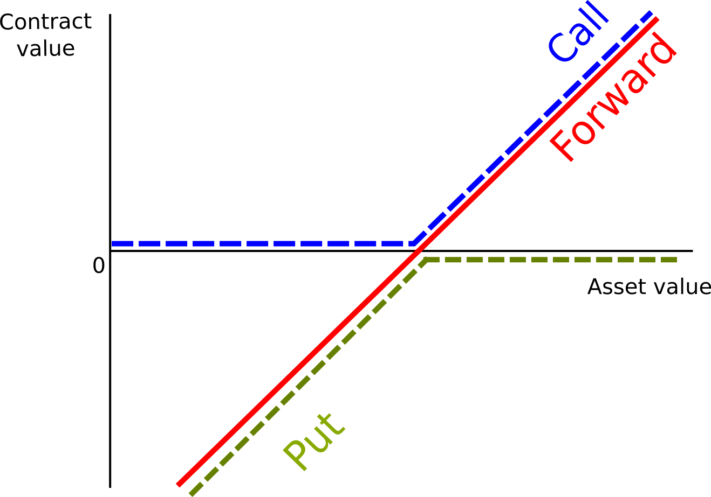
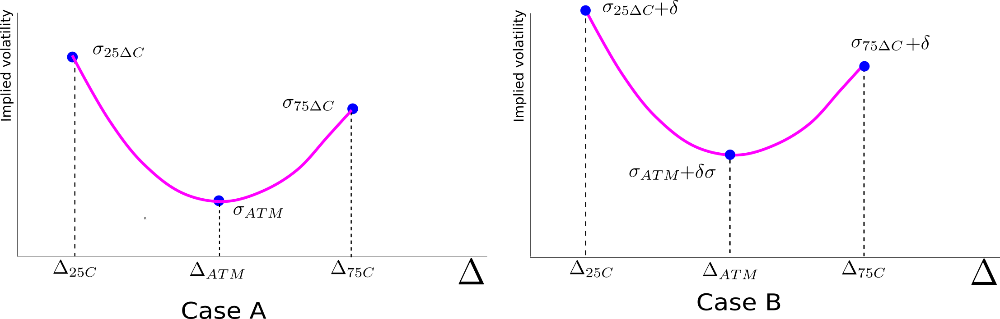
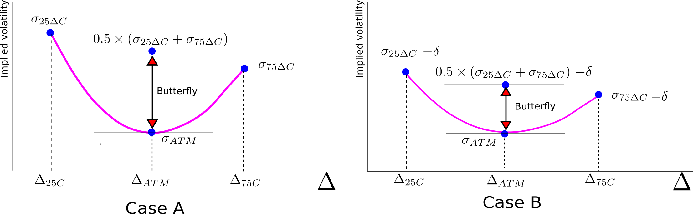

# The volatility smile

Quoting implied vols for a selected range of $\Delta$s and maturities has some advantages. First, it singles specific option contracts. For instance, it is possible to monitor how the price of the constant 3-month maturity 25$\Delta$ call option evolves over time. At any time, the strike price is set such that $\Delta$ is equal to 0.25. If in contrast, we were monitoring a contract with a specific strike price in terms of the value of the exchange rate, the contract $\Delta$ would be changing constantly as the spot rate and interest rates are different. 

Second, the fact that prices are quoted in volatility units facilitates comparing prices at different points in time. Were the premium quoted in money terms, i.e. US dollar per British pound, it would be difficult to state whether the option has become cheaper or more expensive since the premium reflect the effect of several variables besides the implied volatility parameter. But the latter is the one that captures the cost of manufacturing the option, including demand and supply effects.

The main advantage of the market convention, however, is that it identifies the three main unobserved drivers of currency option prices: level, slope, and curvature.^[These three factors are analogous to the level, slope, and curvature factors that completely characterize the behavior of the yield curve [@Litterman-Scheinkman1991].] We analyze them using the $ATM$ vol, and the implied volatilities of the 25$\Delta$ call, and the 75$\Delta$ call. Dealers only quote the value of the first instrument. But some simple algebra and an application of the put-call parity yields the values of the last two instruments using the price quotes for the risk reversals and butterfly spreads:

\[
\begin{aligned}
  \sigma_{25\Delta C} &= \sigma_{ATM} + BF_{25\Delta} + \frac{1}{2} RR_{25\Delta}\\
  \sigma_{25\Delta P} &= \sigma_{ATM} + BF_{25\Delta} - \frac{1}{2} RR_{25\Delta}\\
  \sigma_{75\Delta C} &= \sigma_{25\Delta P}
\end{aligned}
\]
</br>

With these three points, it is possible to fit a second-degree polynomial, or a non-parametric spline function associating an implied volatility to any $\Delta$. This is the **volatility smile** in the $\Delta$- volatility space, and we can use it to price options with strikes other than the $ATM$ and those implied by the 25$\Delta$ and 75$\Delta$. 

## Box 2. Put-call parity{-}
<div style = "background-color:#f7f7f7; width:auto; height:auto; padding-top:0.5px; 
padding-bottom:5px; padding-left:20px; padding-right:20px; font-size:90%; border:1px solid black">

The combination of a short put position (sell the put) and a long call position (buy the call) mimics the payoff of a long forward position (buy the currency forward) with strike price equal to the forward rate, $F$, at maturity:

\

```{r echo=FALSE, out.width="60%", fig.cap="Put-call parity"}

```

\

The following equality must hold:

\[
C(T) - P(T) = F(T)
\]

where $C(T)$, $P(T)$, and $F(T)$ are prices of the call, the put, and the forward at maturity, $T$. If the contracts are entered at time 0, the present value of the option position, $C(0) - P(0)$ should still be the same as the present value of the forward position, $F \exp(-R_d \times T)$, where $R_d$ is the domestic discount rate. But the value of $F$ is determined by the covered interest parity conditions and equal to

\
\[
F= S(0) \exp((R_d-R_f) \times T ),
\]
\

 where $R_f$ is the foreign discount rate. The put-call parity follows:

\
\[
C(0) - P(0) = S(0) \exp(-R_f \times T)
\]

\
Taking derivatives with respect to $S(0)$ yields the following relationship between the $\Delta$s of a call and a put:

\
<center>
<div style="border:1px solid black; width:300px">
\[
\Delta_C - \Delta_P = \exp(-R_f \times T)
\]
</div>
</center>

\

When the foreign interest rate is small and/or the time to maturity is short, the put-call parity is approximately 
\ 
\[
\Delta_C - \Delta_P \approx 1
\]
\

</div>

\


## Level

To see the association between the $ATM$ vol and the level effect, Payne increased the $ATM$, 25$\Delta$, and 75$\Delta$ vols by the same amount, $\delta$. She drew a chart showing the impact on the volatility smile before and after the vol increase:

\
```{r echo=FALSE, out.width="`100%", fig.cap="The $ATM$ vol reflects the level of the smile"}

```
\

Th shape of the volatility smile did not change at all. This was the expected result: Payne remembered, from her high school algebra classes, that such transformation was equivalent to just an upward translation of the parabola determined by the three points. All things equal, changes in $\sigma_{ATM}$ only implies an upward or downward movements of the volatility smile, clearly a level effect. Note that the butterfly spread remains unchanged.

## Slope

The other thought experiment Payne conducted was to change the values of the wings in the original chart. Basically, she increased the vol of the 75$\Delta$ call (or 25$\Delta$ put) by $\delta$, and reduced by the same amount the vol of the 25$\Delta$ call. The chart below captured the results of the experiment:

\
```{r echo=FALSE, out.width="100%", fig.cap="The risk-reversal reflects the slope of the smile"}
include_graphics("images/figRRSlope.png")
```
\

The difference between the vols in the wings increased. In other words, the absolute magnitude of the risk reversal, $|\sigma_{25\Delta C} - \sigma_{75\Delta C}|$, increased. If we were to draw a line between the 25$\Delta$ and the 75$\Delta$, we would notice a steepening of the slope of the line. The risk reversal was clearly associated with the slope of the smile.

## Curvature

"Suppose the $ATM$ vol remains unchanged but the volatility in the wings decreases" thought Payne. She did that and drew a chart similar to the one below:

\
```{r echo=FALSE, out.width="`100%", fig.cap="The butterfly spread reflects the curvature of the smile"}

```
\

Flat volatility smiles correspond to low values of the butterfly spread. With three instruments capturing the level, slope, and curvature of the volatility smile, it is possible to replicate a large range of shapes of the volatility smile as long as they are either strictly convex or concave.
