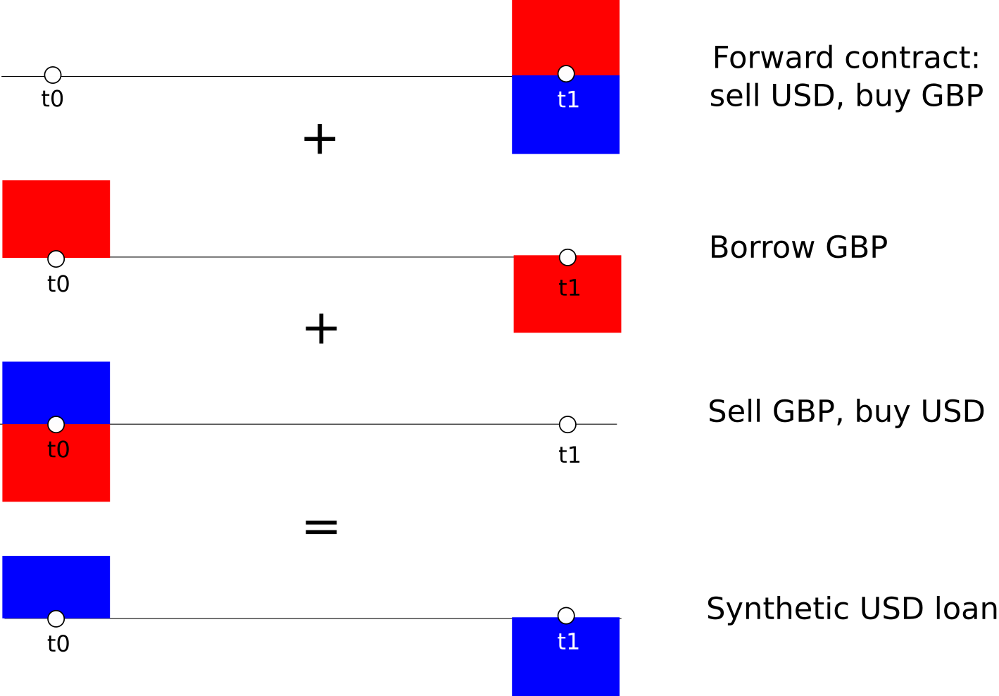
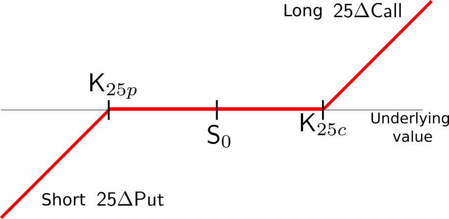

# Introduction {#intro}

B.A. Payne, a recent graduate from the Mostly Infallible Theory Academy (MIT), had just joined the Institutional Macro Fungibility Center (IMF). One of her responsibilities, as a member of the newly formed Multitask Committee on Markets (MCM), was to assess market views on exchange rates. Fresh from her recent participation in the just finalized United Kingdom Financial Services Action Plan (FSAP), her attention naturally turned to the British Pound. Skimming through almost a two-decade old Capital Markets report, Payne saw an interesting chart showing the possible distribution of exchange rates implied by option prices:

\

```{r fig-CMReport, echo=FALSE, out.width="80%", fig.align="center", fig.cap="It was 20 years ago today: IMF, Capital Markets Report, 1997", warning=FALSE}
library(knitr)
include_graphics("images/figJPYRND.png")
```
\

She asked Huff Vihn, the author of the box, for a coffee meeting to discuss information extraction from options. During the meeting, Vihn could only talk about three options: 50, 75, and 85. They were irrelevant to Payne, who was in the flower of her youth. But she could not get much information from Vihn. He had been eating only mushrooms during the past seven years. As Timothy Leary noted, a fungi-edible diet could wreak havoc in somebody's deep neural networks.

Fortunately, Vihn had kept a copy of his data retrieval file and promised to send it to Payne as soon as he was done with an important memorandum. Vihn warned Payne that all the data in the files corresponded to European instruments. Payne was perplexed: "Don't they trade in New York also?". Vihn smiled and clarified that European contracts could only be exercised at the contract maturity, which was exactly the situation for the IMF 50, 75, and 85 options. Payne made a note to read more about that.

The next morning, Payne got the file and an set of charts. "Not bad for a two dollar investment in coffee, I knew I could use the geezer" she thought to herself. Payne rushed to update the file in the committee's Reuters terminal, soon to be decommissioned due to budget reallocation priorities. Following good data practices, she then stored the data in a human-readable `csv` file.

## Examining the data {#Data_exploration}

Payne used `RStudio` to analyze the data. "How wonderful! A great package for a great price! Zero !!". She first loaded a number of useful libraries, and an auxiliary source file using the following commands:

```{r, echo=TRUE, message=FALSE, warning=FALSE, error=FALSE}

rm(list=ls())             # Clean up memory
library(ggplot2)          # Graphic library
library(lubridate)        # Date manipulation library
library(dplyr)            # Auxiliary functions for data manipulation
source("auxFunctions.R")  # Auxiliary functions for this chapter

```

Afterwards, it was a piece of cake to read the data file, and convert the dates to a format the graphics library `ggplot2` could understand:

```{r, echo=TRUE, message=FALSE, warning=FALSE, error=FALSE}

filename = "2018_IET_Options_data.csv"
data = read.csv(filename, header=TRUE)
data$Dates = mdy_hm(as.character(data$Dates))

```

The data file contained weekly mid-prices for a number of financial variables, as shown below:

```{r echo=FALSE, out.width="100%", fig.cap="Data frame structure"}
library(knitr)
include_graphics("images/figDataStructure.png")
```

\

Some of the variables were easy to interpret:

* Spot: the GBPUSD spot exchange rate, i.e. USD per GBP
* FWD3M: the 3-month GBPUSD forward exchange rate
* Rf: the 3-month GBP money market deposit rate, annualized (in percent)
* Rd: the 3-month USD money market deposit rate, annualized (in percent)

Others were related to currency options, all with a 3-month maturity 

* ATM: the at-the-money implied volatility of a GBPUSD option with strike price equal to spot
* RR25D3M: the price of a 25$\Delta$ risk reversal, in annualized volatility units (in percent)
* BF25D3M: the price of a 25$\Delta$ butterfly spread, in annualized volatility units (in percent)
* RR10D3M: the price of a 10$\Delta$ risk reversal, in annualized volatility units (in percent)
* BF10D3M: the price of a 10$\Delta$ butterfly spread, in annualized volatility units (in percent)

The final variable, `ImpliedRd`, was the 3-month USD money market deposit rate implied from the forward rate, obtained from the covered interest rate parity equation:

$$ F = S \frac{\exp \left(\text{Implied } R_d \times T\right)}{\exp \left(R_f \times T\right)} $$

where $F$ is the forward exchange rate, $S$ is the spot exchange rate, $R_x, x= f, d$ denotes the foreign and domestic deposit rates, and $T$ is the time to maturity of the option. For the purpose of the analysis, the British pound is the foreign currency and the US dollar is the domestic currency. To see this, note that the British pound is the base currency or underlying asset since its price is given in US dollars, the numeraire currency.

## Spot exchange rate

It was time to start eyeballing the data. First, she looked at the dynamics of the spot and forward exchange rate highlighting carefully the week of the Brexit referendum vote:

```{r fig.asp = 0.66, out.width="100%", fig.cap="USDGBP spot and forward exchange rate"}
# Plot of the spot exchange rate with vertical line at Brexit vote
p1 = ggplot(data, aes(Dates, Spot)) + geom_line(colour="blue") 
p1 = p1 + geom_vline(xintercept=as.POSIXct(as.Date(("2016-06-22 UTC"))),linetype="longdash")

p2 = ggplot(data, aes(Dates, FWD3M)) + geom_line(colour="red") 
p2 = p2 + geom_vline(xintercept=as.POSIXct(as.Date(("2016-06-22 UTC"))),linetype="longdash")

multiplot(p1,p2,cols=1)

```

\

The behavior of both series were quite similar. Both the spot and forward rates had been range bound in the first half of 2016 and their behavior did not anticipate the exchange rate correction following the referendum. Payne proceed to analyze the other data series hoping they could provide additional information.

## Implied and actual USD rates

A cursory glimpse of the data had shown that the actual USD deposit rate was different from the rate implied from the forward exchange rate. Payne examined this, by first calculating the rate spread:

```{r fig.asp = 0.33, out.width="100%", fig.cap ="Implied and current 3-month USD deposit rate differential, in bps"}
data$spreadRd = (data$ImpliedRd - data$Rd)*100
p3 = ggplot(data, aes(Dates, spreadRd)) + geom_line(colour="purple") + geom_hline(yintercept=0)
p3 = p3 + geom_vline(xintercept=as.POSIXct(as.Date(("2016-06-22 UTC"))),linetype="longdash")
p3
```

\

This was an interesting finding. Currency forwards, in combination with spot currency transactions and borrowing,  are useful to create synthetic loans, as the diagram below shows:

<div id ="synthetic-USD-loan">

```{r echo=FALSE, out.width="70%", fig.cap="Synthetic USD loan"}

```

</div>

\
In principle, there should not be major differences between the deposit rate and the synthetic loan rate. Whenever the implied USD rate exceeds the USD deposit rate, a covered interest parity violation, it signals a strong demand for USD satisfied mainly via the synthetic market rather than the cash market. If the rate differential is large and persistent, and above historically levels, it may reflect frictions and liquidity shortages preventing cross-market arbitrage.

Payne observed that before 2015, the 3-month rate differential was small and exhibited low volatility. Starting 2015, the volatility of the rate differential increased, with covered interest parity violations favoring the synthetic US dollar rate. In many instances, the synthetic rate could exceed the cash market rate by as much as 40 bps. Violations, however were short-lived. 

In the post-Brexit period, deviations became larger and more persistent. At one moment, the synthetic and the cash rates were even, roughly coinciding with the Tories' loss of their parliamentary majority in June 2017. The loss likely sparked hopes that the Brexit process may be halted or reverted. Since the last quarter of 2017, however, the gap between the synthetic and cash rates have widened. Based on the November 2017 Bank of England _Inflation Report_, Payne considered downward revisions of UK growth prospects and Brexit uncertainty were driving appetite for USD assets, leading to the recent widening of the  implied USD rate spread. 

## ATM option volatility

Payne was not very familiar with currency options. She called Stan Ford, an old classmate who was a FX strategist in London, to get some hints. Unfortunately, nobody picked up the phone. Unbeknownst to her, the firm had replaced Stan with an impressive Asian ML/AI trading system, _UZakAIDon_. Depressed, Stan had checked into solitary confinement in an Italian monastery. So she picked up an old derivatives textbooks somebody had left in the bookcases outside her closet office. Although old, it looked like new as the shrink wrap had never been removed. She went straight to the chapter on options and looked at the payoff of an European call option at maturity:

\
<div id = "figure-call-option">
```{r echo=FALSE, out.width="70%", fig.cap="Call option payoff at maturity"}
include_graphics("images/figCallOptionMaturity.png")
```
</div>
\
At maturity, the option buyer, who is long the call, has the right to exercise the option. If he does, he receives a payoff equal to $S_T -K$. Clearly, exercising the option makes sense only when the value of the underlying is above the strike price the option is said to be in the money <font color="red"> _in-the-money_ (ITM)</font>. More generally, the option is _ITM_ whenever the spot price is above the strike price, regardless of the time to maturity.  When the value of the underlying is equal to the strike price, the option is <font color="green">_at-the-money_ (ATM)</font> Otherwise, it is <font color="blue">_out of the money_ (OTM)</font>. For the GBPUSD options, the underlying is the British pound, which is quoted as the amount of US dollars needed to buy one pound, or the GBPUSD exchange rate. The call option is worth more when the pound appreciates against the dollar.

There were some tedious formulas and derivations related to the pricing of the options. Payne found the math insufferable. She had accepted the job at the IMF because her comparative advantage was policy making. In fact, she never appreciated the  "mathiness" environment prevalent in graduate school. Payne felt a jolt of relief when she encountered a passage in the book stating that **dealers quoted currency option prices as implied volatility, or _vols_**. "Hence, all I need to do now is check what happens to the vols!"

An examination of the call option chart provided some support for the market practice: for an OTM option, higher volatility implies a greater chance that the option ends ITM. For an ITM option, higher volatility implies higher payoffs while the downside risk is limited to losing the option premium.The higher the vol, the more expensive the currency option is.

The book also noted that to obtain prices, the vol should be input into the benchmark Garman-Kolhagen currency option pricing model.^[-@Garman-Kohlhagen1983] This model, in turn, was derived from another one that explains the emergence of black holes in the universe, the celebrated Black-Scholes-Merton model.^[-@Black-Scholes1973 and -@Merton1973]  

"I would check the theory later," Payne mumbled to herself while plotting the ATM volatility:

```{r fig.asp = 0.33, out.width="100%", fig.cap ="ATM volatility"}
p4 = ggplot(data, aes(Dates, ATM)) + geom_line(colour="blue") + geom_hline(yintercept=0)
p4 = p4 + geom_vline(xintercept=as.POSIXct(as.Date(("2016-06-22 UTC"))),linetype="longdash")
p4
```
\

The chart showed that ATM volatility increased rapidly during the first half of 2016, but slumped rapidly after Brexit. During most of 2017 it had been in a narrow range, reflecting the range-like behavior of the exchange rate. 

The chart was somewhat puzzling. Apparently, options became more valuable in the months before the referendum. A more valuable call option seemingly implied a higher exchange rate, or an appreciation of the GBP against the USD. But this assertion was at odds with the behavior of the implied and actual USD rates. The solution to this puzzle was rather simple: put options also benefit from higher volatility.

\

```{r echo=FALSE, out.width="70%", fig.cap="Put option payoff at maturity"}
include_graphics("images/figPUtOptionMaturity.png")
```

\
For an OTM option, higher volatility could push the exchange rate down, i.e. the pound depreciates against the dollar, forcing the option to be in the ITM. The downside is limited to losing the option premium. In contrast to the call option, upside gains are capped. But the buyer of the put still benefits more from increased volatility. We can conclude that ATM volatility is not enough to capture the market's view on the direction of exchange rate changes. In contrast to academic textbooks, a number of market practitioners would attest that plain options are  instruments for expressing views on volatility and not on market direction.^[@Derman-Miller2016] 

## Risk Reversals

To assess directional views, it is necessary to look at risk reversals, a particular combination of simpler options. The options book, being old, did not say anything about risk reversals. Thankfully, the Google had offered the Home at a discount price during last Black Friday. Payne asked her Google Home what a risk reversal was and obtained the following answer from Wikipedia:

<div style="border:1px solid black;padding-left:20px; padding-right:20px;">
```{r echo=FALSE, out.width="100%", fig.cap="Risk reversal definition (Wikipedia)"}
include_graphics("images/figRRDefinition.png")
```
</div>

\
A full understanding of the risk reversal requires knowing what $\Delta$ is. Even without that knowledge, however, we can use risk reversal quotes to assess the prices market participants place on potential exchange rate movements. Let's start with the price quote of a risk reversal:

\[
RR_{25\Delta} = \sigma_{25\Delta C} - \sigma_{25\Delta P}
\]

We pay $\sigma_{25\Delta C}$ for owning the call and offset this cost somewhat by selling the put at $\sigma_{25\Delta P}$. At maturity, the payoff diagram of the risk reversal, long a call and short a put, both of them OTM, is:

\

```{r echo=FALSE, out.width="70%", fig.cap="Risk reversal payoff at maturity"}

```

\

When the call is more valuable than the put, the value of the risk reversal is positive. The buyer of the risk reversal values more events in which the GBPUSD exchange rate goes up. The opposite is true when the risk reversal is negative, i.e. the put is more valuable than the call. Risk reversals reveals potential asymmetries affecting exchange rate movements. In the case of the British pound, bullish market views are reflected in positive risk reversals. On the other hand, bearish views are reflected in negative risk reversals. Payne plotted both the 25$\Delta$ and 10$\Delta$ risk reversals:

```{r out.width="100%", fig.cap="GBPUSD Risk reversals"}
p5 = ggplot(data, aes(Dates, RR25D3M)) + geom_line(colour="red") + geom_hline(yintercept=0)
p5 = p5 + geom_vline(xintercept=as.POSIXct(as.Date(("2016-06-22 UTC"))),linetype="longdash")

p6 = ggplot(data, aes(Dates, RR10D3M)) + geom_line(colour="blue") + geom_hline(yintercept=0)
p6 = p6 + geom_vline(xintercept=as.POSIXct(as.Date(("2016-06-22 UTC"))),linetype="longdash")
multiplot(p5, p6, cols=1)
```

Since 2013, risk reversals had been negative. There were some brief periods during which the 25$\Delta$ risk reversals turned positive. During the first half of 2016 both the 10$\Delta$ and the 25$\Delta$ risk reversals dropped substantially as markets placed more weight on the depreciation of the pound than on its appreciation. In combination with the ATM vol, the dramatic widening of the risk reversals anticipated the sharp exchange rate correction following the Brexit referendum.

## Butterfly spreads

"Quite interesting," thought Payne. "Regardless of its perceived lack of ethics, creativity in the financial industry abounds." She wondered what instrument could be useful for an investor expecting the exchange rate to experience either large movements on the upside or the downside. Remembering the risk reversal payoff chart, she concluded that it was a simple as flipping the short put position over the horizontal axis. That is, holding both a long OTM call and a long OTM put position should do the trick. She drew this chart, keeping the strikes of the put and the call at the values they had in the risk reversal:

\

```{r echo=FALSE, out.width="70%", fig.cap="Strangle payoff at maturity"}
include_graphics("images/fig25BFSimple.png")
```

\

Payne had just re-discovered the **strangle**. This instrument typically delivers a positive payoff when the underlying is very volatile. For instance, speculators use strangles to position themselves ahead of earning releases. Missing or exceeding earning expectations trigger large downside and upside movements in the stock price, benefiting strangle holders.

Using the same convention as for the risk reversals, the price of a 25$\Delta$ strangle is:

\[
S_{25\Delta} = \sigma_{25\Delta C} + \sigma_{25\Delta P}
\]

The only glitch, however, was that the quoted prices were for butterfly spreads. FX dealers quote the price of a 25$\Delta$ butterfly spread as:

\[
BF_{25\Delta} = \frac{\sigma_{25\Delta C} + \sigma_{25\Delta P}}{2}  - \sigma_{ATM}
\]

"This is very annoying but there must be a meaning to this convention," Payne whispered to herself. Suddenly, she remembered what Stan, the now vanished FX trader, used to say: "We never put our own money in the trades." Examining the risk reversal again, she realized that its cost, $\sigma_{25\Delta C} - \sigma_{25\Delta P}$ had to be lower than buying a simple call $\sigma_{25\Delta C}$. The sale of the put offset the purchase price of the call. 

For the strangle, she needed to buy both the call and the put. "How would I offset that? By selling two ATM options, of course!" she exclaimed. "What a strange convention but it does make a lot of sense" whispered Payne to herself. To understand better why FX dealers would prefer the butterfly to the strangle, Payne draw two diagrams, unaware that she was taking the first steps toward unlocking the concept of the volatility smile:

\

```{r echo=FALSE, out.width="100%", fig.cap="Strangles vs. butterflies"}
include_graphics("images/figStrangleButterfly.png")
```

\
In both cases, the value of the strangle is the same and equal to $\sigma_{25\Delta C} + \sigma_{25\Delta P}$. Taking half the strangle price and subtracting the $ATM$ vol yield different butterfly values in cases A and B. Assuming roughly that the vols corresponded to the weights markets placed on certain strike price values, it became clear that the butterflies convey much more information than the strangles. In case A, the market prices upside and downside movements only slightly higher than the event that exchange rate stays close to the $ATM$ level. In contrast, in case B, the market places way more weight on the events that the exchange rate will deviate substantially from the $ATM$ level.


She then plotted the butterfly quotes and obtained these charts:


```{r out.width="100%", fig.cap="GBPUSD Butterflies"}
p7 = ggplot(data, aes(Dates, BF25D3M)) + geom_line(colour="red") + geom_hline(yintercept=0)
p7 = p7 + geom_vline(xintercept=as.POSIXct(as.Date(("2016-06-22 UTC"))),linetype="longdash")

p8 = ggplot(data, aes(Dates, BF10D3M)) + geom_line(colour="blue") + geom_hline(yintercept=0)
p8 = p8 + geom_vline(xintercept=as.POSIXct(as.Date(("2016-06-22 UTC"))),linetype="longdash")
multiplot(p7, p8, cols=1)

```

\

From 2014 onward, butterfly quotes had been mostly range bound. The notable exception was the first half of 2016, when butterfly quotes reached record high levels three to four times the average level observed in the previous three years. The combination of the $ATM$ vol, the risk reversals, and the butterflies was indeed revealing much about market sentiment in the pre- and post- Brexit periods.

