```{r setup, include=FALSE}
knitr::opts_chunk$set(echo = FALSE)
```

# Objectives

- We want to build this

```{r fig-CMReport, echo=FALSE, out.width="60%", fig.align="center", warning=FALSE}
library(knitr)
include_graphics("images/figJPYRND.png")
```


# What we will cover

- Learn about basic FX structures
- Develop some intuition about FX option prices
- Get comfortable with a variety of methods
- Side benefit: learn `R` and `RStudio`!
- Lecture notes available at 
\
\color{red}
https://jchanlauimf.github.io/IMF_FXOptions

#
\color{blue}
\LARGE{Part A:}
\
\LARGE{The Very Basics}


# Basics: a plain vanilla call option

```{r echo=FALSE, out.width="80%", fig.align="center", warning=FALSE}
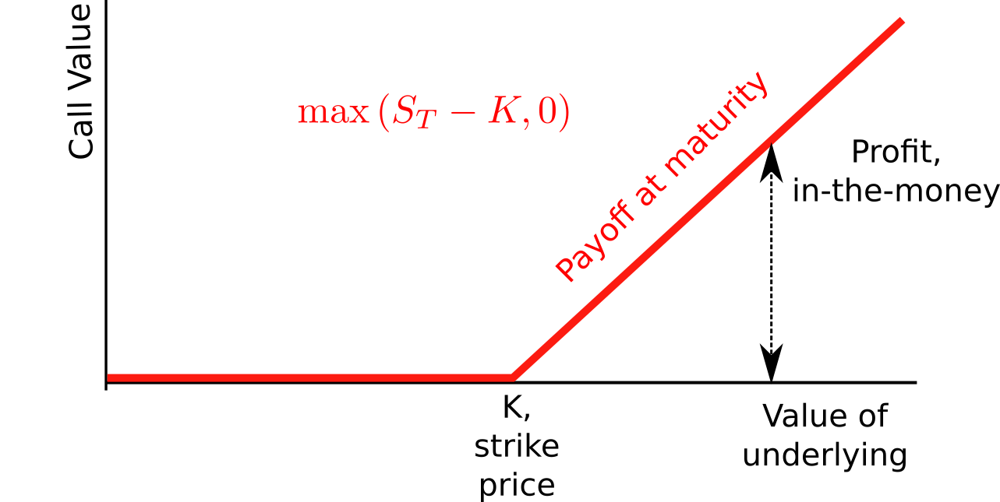
```

# Basics: a plain vanilla put option

```{r  echo=FALSE, out.width="80%", fig.align="center",  warning=FALSE}
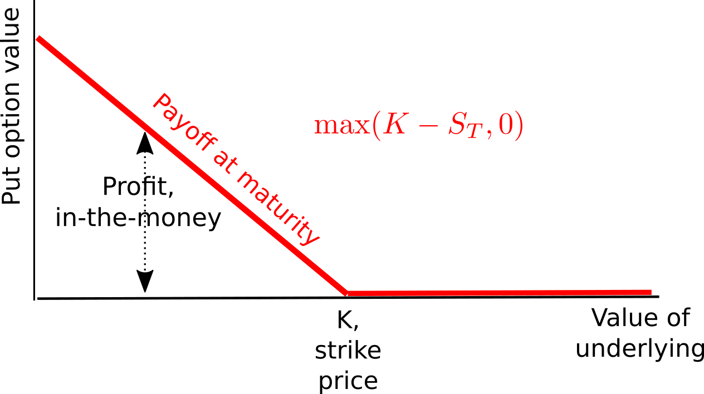
```

# Market reality

- Price quote available for 
    + ATM plain options
  
- Price quotes available for **FX structures**
    + risk reversals
    + butterfly spreads
  
- Main data sources
    + Bloomberg 
    + Reuters
    + Investment banks' data portals


#
\color{blue}
\LARGE{Part B:}
\
\LARGE{Eyeballing the Data}

# Getting the data in (1)

1. Start `RStudio`
2. Set the working directory to where we placed the data file
3. Issue this command in the console (replace with your directory)

```{r, eval=FALSE, echo=TRUE, message=FALSE, warning=FALSE, error=FALSE}
my_wdir = "D:/IMF_FXCourse"  # replace with your directory
setwd(my_wdir)
```

# Getting the data in (2)

Clean memory, set up the needed libraries

```{r, echo=TRUE, message=FALSE, warning=FALSE, error=FALSE}

rm(list=ls())             # Clean up memory
library(ggplot2)          # Graphic library
library(lubridate)        # Date manipulation library
library(dplyr)            # Data manipulation library
source("auxFunctions.R")  # Auxiliary functions

```

# Getting the data in (3)

```{r, echo=TRUE, message=FALSE, warning=FALSE, error=FALSE}

filename = "2018_IET_Options_data.csv"
data = read.csv(filename, header=TRUE)
data$Dates = mdy_hm(as.character(data$Dates))

```

```{r  echo=FALSE, out.width="100%", fig.align="center",  warning=FALSE}
include_graphics("images/figDataStructure.png")
```

# The data (1) 

FX related

* Spot: the GBPUSD spot exchange rate, i.e. USD per GBP
* FWD3M: the 3-month GBPUSD forward exchange rate
* Rf: the 3-month GBP money market deposit rate, annualized (in percent)
* Rd: the 3-month USD money market deposit rate, annualized (in percent)

# The data (2) 

FX option related

* ATM: the at-the-money implied volatility of a GBPUSD option with strike price equal to ATM
* RR25D3M: the price of a 25$\Delta$ risk reversal, in annualized volatility units (in percent)
* BF25D3M: the price of a 25$\Delta$ butterfly spread, in annualized volatility units (in percent)
* RR10D3M: the price of a 10$\Delta$ risk reversal, in annualized volatility units (in percent)
* BF10D3M: the price of a 10$\Delta$ butterfly spread, in annualized volatility units (in percent)

# The data (3)

$$ \text{Implied domestic rate from covered interest parity:  }F = S \frac{\exp \left(\text{Implied } R_d \times T\right)}{\exp \left(R_f \times T\right)} $$

```{r  echo=FALSE, out.width="60%", fig.align="center",  warning=FALSE}
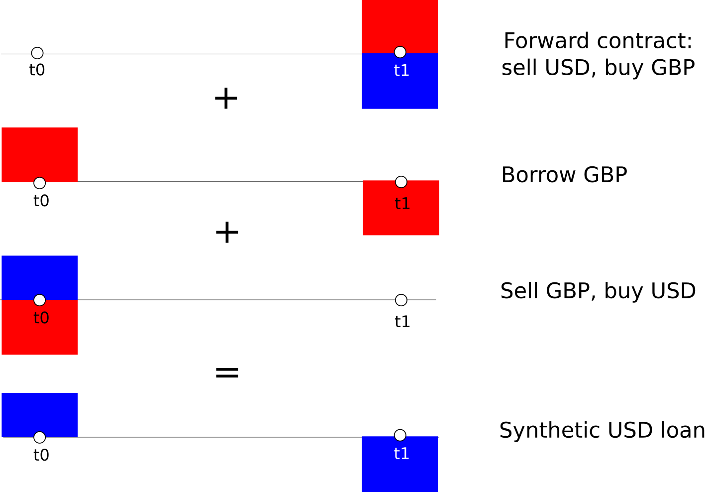
```

# What the data tell us: spot and forward FX rates (1)

```{r fig.asp = 0.33, echo=TRUE, out.width="100%", fig.cap="USDGBP spot exchange rate"}
# Plot of the spot exchange rate with vertical line at Brexit vote
p1 = ggplot(data, aes(Dates, Spot)) + geom_line(colour="blue") 
p1 = p1 + geom_vline(xintercept=as.POSIXct(as.Date(("2016-06-22 UTC"))),
                     linetype="longdash")
p1

```

# What the data tell us: spot and forward FX rates (2)

```{r fig.asp = 0.33, echo=TRUE, out.width="100%"}

p2 = ggplot(data, aes(Dates, FWD3M)) + geom_line(colour="red") 
p2 = p2 + geom_vline(xintercept=as.POSIXct(as.Date(("2016-06-22 UTC"))),
                     linetype="longdash")
p2

```

# What the data tell us: domestic rate differentials

```{r fig.asp = 0.33, echo=TRUE, out.width="100%"}
data$spreadRd = (data$ImpliedRd - data$Rd)*100
p3 = ggplot(data, aes(Dates, spreadRd)) + geom_line(colour="purple") + 
        geom_hline(yintercept=0)
p3 = p3 + geom_vline(xintercept=as.POSIXct(as.Date(("2016-06-22 UTC"))),
                     linetype="longdash")
p3
```

# What the data tell us: ATM volatility

```{r fig.asp = 0.33, echo=TRUE, out.width="100%", fig.cap ="ATM volatility"}
p4 = ggplot(data, aes(Dates, ATM)) + geom_line(colour="blue") + 
        geom_hline(yintercept=0)
p4 = p4 + geom_vline(xintercept=as.POSIXct(as.Date(("2016-06-22 UTC"))),
                     linetype="longdash")
p4
```

# What the data tell us: risk reversals (1)

<div style="border:1px solid black;padding-left:20px; padding-right:20px;">
```{r echo=FALSE, out.width="100%", fig.cap="Risk reversal definition (Wikipedia)"}
include_graphics("images/figRRDefinition.png")
```
</div>

# What the data tell us: risk reversals (2)

- Full understanding of the risk reversal requires knowing what $\Delta$ is
- But without knowing, we still use risk reversal quotes to assess the prices market participants place on potential exchange rate movements.

\[
RR_{25\Delta} = \sigma_{25\Delta C} - \sigma_{25\Delta P}
\]

- Pay $\sigma_{25\Delta C}$ for owning the call 
- Offset cost somewhat by selling the put at $\sigma_{25\Delta P}$ 

# What the data tell us: risk reversals (3)

- Risk reversal payoff, long a call and short a put, both of them OTM:

```{r echo=FALSE, out.width="70%", fig.cap="Risk reversal payoff at maturity"}
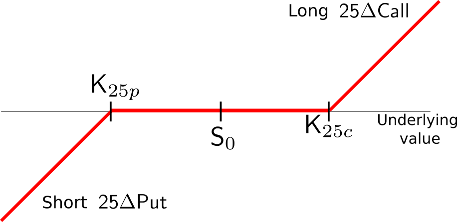
```

- Explain why the price could be positive (or negative)?

# What the data tell us: risk reversals (4)

```{r out.width="100%", fig.asp=0.33, echo= TRUE}
p5 = ggplot(data, aes(Dates, RR25D3M)) + geom_line(colour="red") + 
        geom_hline(yintercept=0)
p5 = p5 + geom_vline(xintercept=as.POSIXct(as.Date(("2016-06-22 UTC"))),
                     linetype="longdash")
p5
```

# What the data tell us: risk reversals (5)

```{r out.width="100%", fig.asp=0.33, echo= TRUE}
p6 = ggplot(data, aes(Dates, RR10D3M)) + geom_line(colour="blue") + 
        geom_hline(yintercept=0)
p6 = p6 + geom_vline(xintercept=as.POSIXct(as.Date(("2016-06-22 UTC"))),
                     linetype="longdash")
p6
```


# What the data tells us: butterfly spreads (1)

- Suppose we want to profit from large movements of the exchange rate
- The strangle would make our day !!

</br></br>
```{r echo=FALSE, out.width="70%", fig.align="center"}
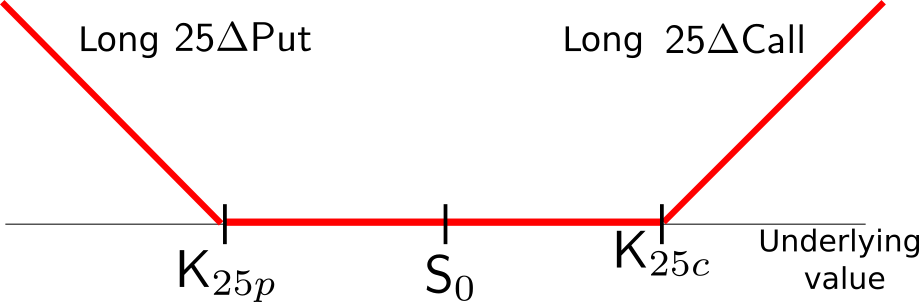
```

# What the data tells us: butterfly spreads (2)

- The cost of the strangle is:

\[
S_{25\Delta} = \sigma_{25\Delta C} + \sigma_{25\Delta P}
\]

- But markets don't quote strangles
\
\

- They quote **Butterfly Spreads**

\[
BF_{25\Delta} = \frac{\sigma_{25\Delta C} + \sigma_{25\Delta P}}{2}  - \sigma_{ATM}
\]

# What the data tells us: butterfly spreads (3)

- Butterfly spreads convey more information

```{r echo=FALSE, out.width="100%", fig.align="center"}
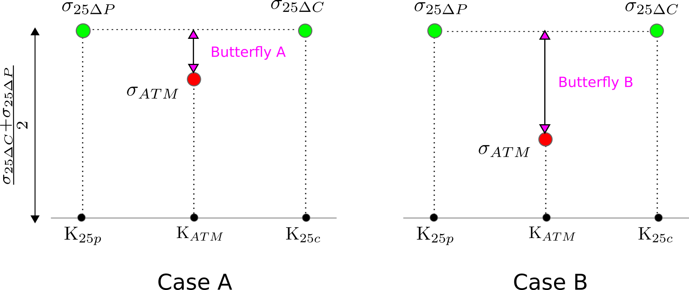
```

# What the data tells us: butterfly spreads (4)

```{r fig.asp=0.33  ,out.width="100%", echo = TRUE, fig.align="center"}
p7 = ggplot(data, aes(Dates, BF25D3M)) + geom_line(colour="red") + 
        geom_hline(yintercept=0)
p7 = p7 + geom_vline(xintercept=as.POSIXct(as.Date(("2016-06-22 UTC"))),
                     linetype="longdash")
p7
```

# What the data tells us: butterfly spreads (5)

```{r fig.asp=0.33  ,out.width="100%", echo = TRUE, fig.align="center"}
p8 = ggplot(data, aes(Dates, BF10D3M)) + geom_line(colour="blue") + 
        geom_hline(yintercept=0)
p8 = p8 + geom_vline(xintercept=as.POSIXct(as.Date(("2016-06-22 UTC"))),
                     linetype="longdash")
p8
```


#
\color{blue}
\LARGE{Part C:}
\
\LARGE{A Little Bit of Option Pricing}


# What is $\Delta$ (1)

- The $\Delta$ of a call

\[ \Delta_C = \frac{\partial C}{\partial S} \geq 0\]

- The $\Delta$ of a put

\[ \Delta_P = \frac{\partial P}{\partial S} \leq 0\]

# What is $\Delta$ (2)

```{r echo=FALSE, out.width="80%", fig.align="center"}
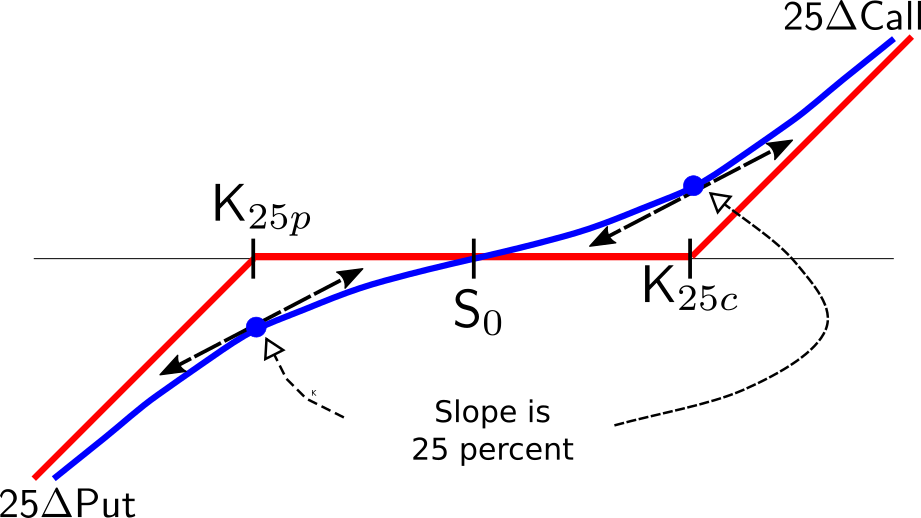
```

# What is $\Delta$ (3)

```{r echo=FALSE, out.width="80%", fig.align="center"}
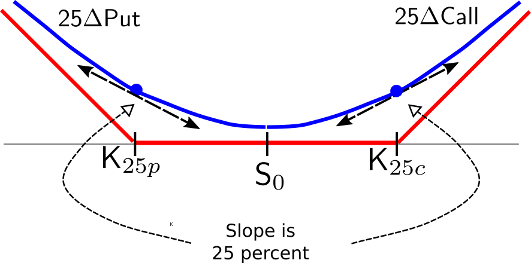
```

# What is $\Delta$ (4)

```{r echo=FALSE, out.width="100%", fig.align="center"}
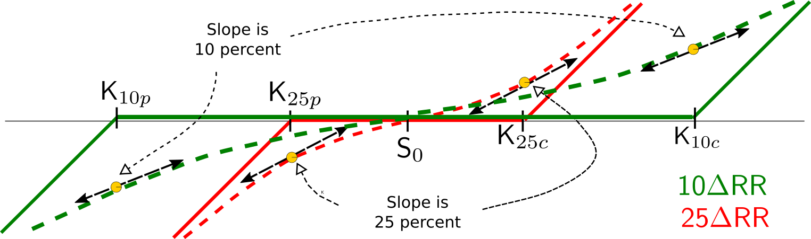
```

# Option prices = replication cost (1)

Dealer costs when buying call option from client 

- Funding cost: borrow $C$ at $R_d$: $R_d C_t \delta t$
\
- Hedging cost (using delta-hedging)
    + Borrow and sell $\Delta$ units of foreign currency
    + Receive $\Delta S$ and reinvest at $R_d$
    + Pay accrued interest on borrowed amount of currency
    + Net gain: $(R_d - R_f)\Delta S_t \delta t$
    
    
# Option price = replication cost (2)

- Time decay of option: loses value as maturity approaches
     $$\frac{\partial C_t}{\partial t} \delta t$$
\
\ 
- Convexity gains since options are non-linear
  $$ \frac{\partial^2 C_t}{\partial S^2}(\delta S_t)^2$$

# Option price = replication cost (3)

- Gains must offset costs, yielding the pricing partial differential equation:

\[
\frac{\partial C_t}{\partial t} \delta t + (R_d - R_f) \Delta S_t  \delta t + \frac{\partial^2 C}{\partial S_t^2} (\delta S_t)^2 = R_d C_t \delta t
\]

# Garman-Kohlhagen formula (1)

Assume FX follows a geometric brownian motion, the call option price is:

\[
\boxed{
C(K,S_t,R_d,R_f,T,\sigma) = S_t \exp(-R_f\times(T-t))N(d_1) - K\exp(-R_d \times (T-t))N(d_2)
}
\]

and the put option price is:

\[
\boxed{
P(K,S_t,R_d,R_f,T,\sigma) = K\exp(-R_d \times (T-t))N(-d_2) - S_t \exp(-R_f\times(T-t))N(-d_1) 
}
\]

# Garman-Kohlhagen formula (2)

- $K$ is the strike price,
- $S_t$ is the current spot exchange rate,
- $R_d$ is the domestic interest rate,
- $R_f$ is the foreign interest rate,
- $T-t$ is the remaining life of an option maturing at time $T$,
- $\sigma$ is the implied volatility of the exchange rate used to price the option,
- \[
\begin{aligned}
d_1 &= \frac{\ln(S_t/K)+(R_d-R_f+\sigma^2/2)(T-t)}{\sigma \times (T-t)}\\
d_2 &= d_1 - \sigma \times (T-t)
\end{aligned}
\]

# Implied volatility $\sigma$ (1)

- All GK formula inputs are observable except implied volatility $\sigma$
\
\
- Option prices are quoted as **vols**, i.e. volatility
\
\
- To obtain price
    + Take quoted vol
    + Use reference values for all other variables
    + Plug into GK formula
    
    
# Implied volatility $\sigma$ (2)

Implied volatility

- is different from historical or realized volatility
\
\
- is not a forecast of future volatility
\
\
- yields an GK option premium reflecting
    + profit margin
    + hedging costs
    + demand and supply in the FX market


#
\color{blue}
\LARGE{Part D:}
\
\LARGE{The Volatility Smile}


# Finding vols for different $\Delta$s

- For a given $\Delta$ we have prices for:
    + Risk reversal (RR)
    + Butterfly spread (BF)
    
- The ATM vol, $\sigma_{ATM}$ is also given

- From the definitions of the RR and the BF

\[
\begin{aligned}
  \sigma_{25\Delta C} &= \sigma_{ATM} + BF_{25\Delta} + \frac{1}{2} RR_{25\Delta}\\
  \sigma_{25\Delta P} &= \sigma_{ATM} + BF_{25\Delta} - \frac{1}{2} RR_{25\Delta}\\
  \sigma_{75\Delta C} &= \sigma_{25\Delta P}\enspace \text{by put-call parity}
\end{aligned}
\]

- Plotting $\sigma$ against $\Delta$ yields the volatility smile

# The level of the smile: $\sigma_{ATM}$

```{r echo=FALSE, out.width="100%"}
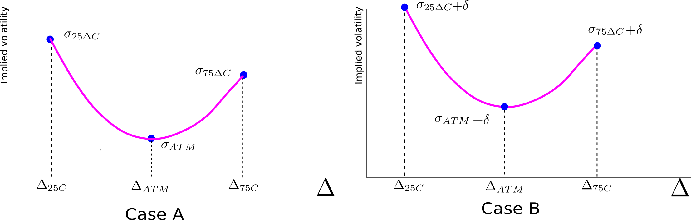
```

# The slope of the smile: the risk reversal

```{r echo=FALSE, out.width="100%"}
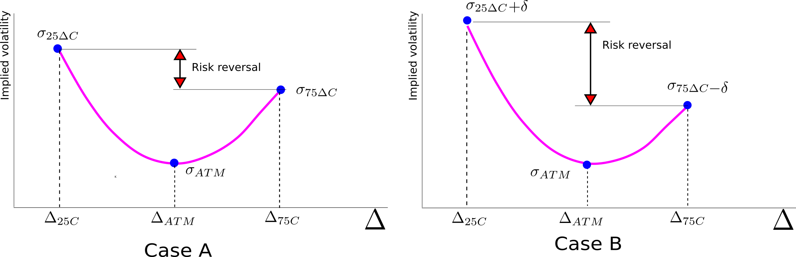
```

# The slope of the smile: the butterfly spread

```{r echo=FALSE, out.width="100%"}
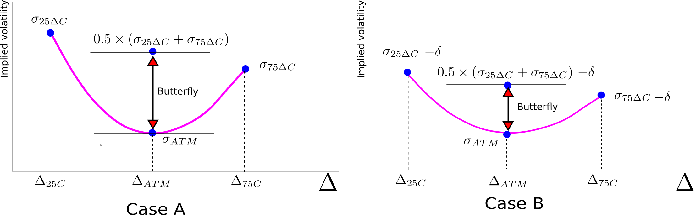
```

#
\color{blue}
\LARGE{Part E:}
\
\LARGE{Constructing the Volatility Smile}
\ 
\Large{A Brexit case study}

# Selecting the dates

We are interested in the behavior of the GBPUSD for three dates:

- January 8, 2016 (Pre-Brexit)
- June 24, 2016   (Brexit)
- December 30, 2016 (Post-Brexit)

# Getting the data (1)

```{r echo=TRUE, out.width="100%", message=FALSE, warning=FALSE, paged.print=FALSE}
rm(list=ls())                                     # Clean up memory
filename = "2018_IET_Options_data.csv"            # Name of CSV data file
data = read.csv(filename, header=TRUE)            # Load datafile
data$Dates = mdy_hm(as.character(data$Dates))     # convert dates to Date class
rownames(data)=NULL                               # remove row names

# Specify dates for analysis

date01 = as.Date("2016-01-08 UTC")                 
date02 = as.Date("2016-06-24 UTC")
date03 = as.Date("2016-12-30 UTC")
```

# Getting the data (2)

```{r echo=TRUE, out.width="100%", message=FALSE, warning=FALSE, paged.print=FALSE}
# Create data frame this.data

this.data = rbind(
  data[which(data$Dates==date01),],
  data[which(data$Dates==date02),],
  data[which(data$Dates==date03),])

# Delete row names and change the names of the columns

rownames(this.data) = NULL
colnames(this.data) = c("Date","spot","forward","atm", "rr25","bf25",
                        "rr10","bf10","rf","rd","imp_rd")
```


# Get additional vols

In addition to the 25$\Delta$ and 75$\Delta$ vols, obtain the 10$\Delta$ and 90$\Delta$ vols:

\[
\begin{aligned}
  \sigma_{10\Delta C} &= \sigma_{ATM} + BF_{10\Delta} + \frac{1}{2} RR_{10\Delta}\\
  \sigma_{10\Delta P} &= \sigma_{ATM} + BF_{10\Delta} - \frac{1}{2} RR_{10\Delta}\\
  \sigma_{90\Delta C} &= \sigma_{10\Delta P}
\end{aligned}
\]

# Calculating the implied vols (1)

```{r echo=TRUE, message=FALSE, warning=FALSE, out.width="100%", paged.print=FALSE}
# Vols are in percent, expressed them as simple numbers
this.data$atm  = this.data$atm/100
this.data$rr25 = this.data$rr25/100
this.data$bf25 = this.data$bf25/100
this.data$rr10 = this.data$rr10/100
this.data$bf10 = this.data$bf10/100
this.data$rf   = this.data$rf/100
this.data$rd   = this.data$rd/100
this.data$imp_rd=this.data$imp_rd/100

# We will use this.data repeatedly
# Attach it to access its elements

attach(this.data)     
```

# Calculating the implied vols (2)

```{r echo=TRUE, message=FALSE, warning=FALSE, out.width="100%", paged.print=FALSE}
# Recover vols for different deltas and put them in the data frame

this.data$sigma10c = atm + bf10 + 0.5*rr10
this.data$sigma25c = atm + bf25 + 0.5*rr25
this.data$sigma75c = this.data$sigma25c - rr25
this.data$sigma90c = this.data$sigma10c - rr10
this.data$sigmaatm = atm

Tenor = 3/12   # Maturity of options, 3 months, in years
```

# What is the $ATM$ strike?

- Retail products
\[
\begin{aligned}
K_{ATM} &= S\\
\Delta_{ATM} &= N \left(\frac{\log(F/S) + \frac{1}{2} \sigma_{ATM}^2 T}{\sigma_{ATM} \sqrt T} \right)
\end{aligned}
\]
- EM currencies, maturities more than one year
\[
\begin{aligned}
K_{ATM} &= F\\
\Delta_{ATM} &= \exp(-Rf \times T)N(\frac{1}{2}\sigma_{ATM} \sqrt T) 
\end{aligned}
\]
- Major currencies, maturities of one year or less
\[
\begin{aligned}
 K_{ATM} &= F \times \exp\left( 0.5 \sigma^2_{ATM}\times T \right)\\
 \Delta_{ATM} &= 0.5\times exp(-Rf \times T) \simeq 0.5 
\end{aligned}
\]

# Calculate the $\Delta_{ATM}$

```{r echo=TRUE, eval=TRUE, message=FALSE, warning=FALSE, paged.print=FALSE}
# Calculate the strike of the ATM option
K_atm = forward*exp((0.5*(this.data$sigmaatm)^2)*Tenor)
deltaATM = 0.5*exp(-rf*Tenor)
deltaATM
```

# Rough volatility smile (1)

```{r echo=TRUE, eval=TRUE, message=FALSE, warning=FALSE, paged.print=FALSE}
# Select only the vols for each delta
list_variables = c("sigma10c", "sigma25c", "sigmaatm", 
                   "sigma75c", "sigma90c")

# Read the data as a matrix
vol_data = t(as.matrix(subset(this.data, select=list_variables)))

# Group the deltas in a vector, to be used in the x-axis
delta_vector = c(0.10, 0.25, 0.5, 0.75, 0.9)

# Create the data frame for the chart
vol.smile  = data.frame(delta_vector, vol_data)   
rownames(vol.smile) = NULL
colnames(vol.smile) = c("Delta","PreBrexit","Brexit","PostBrexit")

```

# Rough volatility smile (2)

```{r echo=TRUE, out.width="100%", fig.asp=0.4, eval=FALSE, message=FALSE, warning=FALSE, paged.print=FALSE}

library(reshape2)
vol.data = melt(vol.smile, id="Delta")
ggplot(data=vol.data, aes(x=Delta, y=value, shape=variable)) +
   geom_point(aes(colour=variable), size=4) +
   labs(y="vol")
```

# Rough volatility smile (3)

```{r echo=FALSE, out.width="100%", fig.asp=0.4, eval=TRUE, message=FALSE, warning=FALSE, paged.print=FALSE}

library(reshape2)
vol.data = melt(vol.smile, id="Delta")
ggplot(data=vol.data, aes(x=Delta, y=value, shape=variable)) +
   geom_point(aes(colour=variable), size=4) +
   labs(y="vol")
```

# A more refined volatility smile (1)

```{r echo=TRUE, out.width="100%", fig.asp=0.4, eval=TRUE, message=FALSE, warning=FALSE, paged.print=FALSE}
# Fit second degree polynomial to smile
fit.Vol = function(data.vol, data.delta,delta.range)
{
  poly.fit = lm(data.vol ~ poly(data.delta, 2, raw=TRUE))  

  # Use fitted polynomial to interpolate Delta-Vol Curve
  delta.square = delta.range*delta.range
  delta.interc = rep(1,length(delta.range))
  
  X = cbind(delta.interc, delta.range, delta.square)
  iVolInterpol = t(t(X)*poly.fit$coefficients)
  iVolInterpol = rowSums(iVolInterpol)

  return(iVolInterpol)
}
```

# A more refined volatility smile (2)

```{r echo=TRUE, out.width="100%", fig.asp=0.4, fig.cap = "Fitted volatility smiles", eval=TRUE, message=FALSE, warning=FALSE, paged.print=FALSE}
# Get the data points from the vol.smile data frame
data.delta = vol.smile$Delta
data.vol  = vol.smile$PreBrexit

# Interpolation and extrapolation range
delta.range = seq(from=0.01, to = 0.99, by=0.005)

# Obtain the volatility smiles
smile.preBrexit =fit.Vol(vol.smile$PreBrexit, data.delta, delta.range)
smile.Brexit    =fit.Vol(vol.smile$Brexit, data.delta, delta.range)
smile.postBrexit=fit.Vol(vol.smile$PostBrexit, data.delta, delta.range)
```

# A more refined volatility smile (3)

```{r echo=TRUE, out.width="100%", fig.asp=0.4, eval=FALSE, message=FALSE, warning=FALSE, paged.print=FALSE}

# Group the extended volatility smiles in a data frame
smile.df = data.frame(delta.range, smile.preBrexit, 
                      smile.Brexit, smile.postBrexit)
rownames(smile.df) = NULL
colnames(smile.df) = c("Delta","preBrexit","Brexit", "postBrexit")

# Create the chart
library(reshape2)
smile.data = melt(smile.df, id="Delta")
ggplot(data = smile.data, aes(x=Delta, y=value, colour=variable)) +
  geom_line(size=1) + labs(y="vol")
```

# A more refined volatility smile (4)

```{r echo=FALSE, out.width="100%", fig.asp=0.4, eval=TRUE, message=FALSE, warning=FALSE, paged.print=FALSE}

# Group the extended volatility smiles in a data frame
smile.df = data.frame(delta.range, smile.preBrexit, smile.Brexit, smile.postBrexit)
rownames(smile.df) = NULL
colnames(smile.df) = c("Delta","preBrexit","Brexit", "postBrexit")

# Create the chart
library(reshape2)
smile.data = melt(smile.df, id="Delta")
ggplot(data = smile.data, aes(x=Delta, y=value, colour=variable)) + 
  geom_line(size=1) + labs(y="vol")
```


#
\color{blue}
\LARGE{Part F:}
\
\LARGE{Extracting Risk-Neutral Densities}

# Market views are risk-neutral, not objective

# Extraction methods

Methods fall under one of three categories:

- Parametric methods
- Semiparametric methods
- Non-parametric methods

# Parametric methods

- Specify a parametric distribution function $F$ for the exchange rate
- For the distribution parameters $\Lambda$, the price of a call option is

\[
C^F(K) = \exp(-R_d\times T) \int_{K}^{\infty} \left( S_T - K\right) dF(S_T; \Lambda), 
\]

- The parameters that fit the market-implied distribution better solve

\[
\arg\min_{\Lambda} \sum_{j=1}^N |C^F(K_j) - C^{\text{Market}}(K_j)|^2
\]

# Semi-parametric methods

- Start with a particular density
- Add expansion terms to distribution
- Each term helps to approximate market-implied distribution

# Non-parametric methods

- Plot value of calls against different strike prices, i.e. **market call function**
- Breeden and Litzenberger: risk-neutral distribution proportional to second derivative of the call function:
\[
\frac{\partial^2 C}{\partial K^2} \bigg\rvert_{K=S} = \exp(-R_d \times T)q(S).
\]
- Use numerical methods to calculate derivative and find risk neutral distribution

# Numerical estimation exercise

- Risk neutral density extraction
    + Generalized beta density (parametric)
    + Edgeworth expansion (semi-parametric)
    + Shimko (non-parametric)

- All methods require constructing call and/or put functions
    + Option premia vs. strike price
    

#
\color{blue}
\LARGE{Part F:}
\
\LARGE{Extracting Risk-Neutral Densities}
\
\Large{Constructing option premium functions}


# Constructing the market call function (1)

- We need to obtain the market call function
- In other words, move from $\Delta$ - $\sigma$ space to _Option premium_ - _Strike_ space
- Two useful functions in `auxFunctions.R`
    + `get.strike()`
    + `GKoption.premium()`

# Constructing the market call function (2)

```{r echo=TRUE, out.width="100%", fig.asp=0.4, eval=TRUE, message=FALSE, warning=FALSE, paged.print=FALSE}
get.strike = function(vol,delta,S0,fwd,rf,Tenor)
{
  aux = qnorm(delta*exp(rf*Tenor))
  aux = aux*vol*sqrt(Tenor)
  aux = aux - 0.5*vol*vol*Tenor
  K = exp(-aux)*fwd
  return(K)
}
```

# Constructing the market call function (3)

```{r echo=TRUE, out.width="100%", fig.asp=0.6, eval=TRUE, message=FALSE, warning=FALSE, paged.print=FALSE}
GKoption.premium = function(K,sigma,S,Tenor,fwd,rf,option_type)
{
  if (option_type =="c") {w=1}
  if (option_type =="p") {w=-1}
  d1 = log(fwd/K)+0.5*sigma*sigma*Tenor
  d1 = d1/(sigma*sqrt(Tenor))
  d2 = d1 - sigma*sqrt(Tenor)
  rd = log(fwd/S)/Tenor + rf
  premium = exp(-rd*Tenor)*(w*fwd*pnorm(w*d1) - w*K*pnorm(w*d2))
  return(premium)
}
```

# Constructing the market call function (3)

Strike ranges for the selected dates:

```{r echo=TRUE, out.width="100%", fig.asp=0.4, eval=TRUE, message=FALSE, warning=FALSE, paged.print=FALSE}
K_preBrexit = mapply(get.strike,smile.df$preBrexit, smile.df$Delta, 
                     S0=spot[1], fwd=forward[1], rf=rf[1], Tenor=0.25)
K_Brexit    = mapply(get.strike,smile.df$Brexit, smile.df$Delta, 
                     S0=spot[2], fwd=forward[2], rf=rf[2], Tenor=0.25)
K_postBrexit= mapply(get.strike,smile.df$postBrexit, smile.df$Delta, 
                     S0=spot[3], fwd=forward[3], rf=rf[3], Tenor=0.25)
```

# Constructing the market call function (4)

Generate the call premia:

```{r echo=TRUE, out.width="100%", fig.asp=0.6, eval=TRUE, message=FALSE, warning=FALSE, paged.print=FALSE}
Call_preBrexit = mapply(GKoption.premium, K_preBrexit, 
                        smile.df$preBrexit, S=spot[1],Tenor=Tenor,
                        fwd=forward[1],rf=rf[1], option_type="c")

Call_Brexit = mapply(GKoption.premium, K_Brexit, 
                     smile.df$Brexit, S=spot[2],Tenor=Tenor,
                     fwd=forward[2],rf=rf[2],option_type="c")

Call_postBrexit = mapply(GKoption.premium, K_postBrexit, 
                         smile.df$postBrexit,S=spot[3],Tenor=Tenor,
                         fwd=forward[3],rf=rf[3],option_type="c")
```

# Constructing the market call function (5)

The data frame `callstrike.df` collects the call premium-strike functions for the selected dates:

```{r echo=TRUE, out.width="100%", fig.asp=0.6, eval=TRUE, message=FALSE, warning=FALSE, paged.print=FALSE}
callstrike.df = data.frame(K_preBrexit, Call_preBrexit, 
                           K_Brexit, Call_Brexit, 
                           K_postBrexit, Call_postBrexit)

```

# Constructing the market call function (6)

Plot the market call function

```{r echo=TRUE, out.width="100%", fig.asp=0.6, fig.cap = "Call premium-strike functions", eval=FALSE, message=FALSE, warning=FALSE, paged.print=FALSE}
ggplot(callstrike.df) +
  geom_line(aes(x=K_preBrexit,y=Call_preBrexit), col="red", size=1) + 
  geom_line(aes(x=K_Brexit, y=Call_Brexit), col="darkcyan", size=1) +
  geom_line(aes(x=K_postBrexit, y=Call_postBrexit), col="blue", size=1) +
  labs(x="GBPUSD", y="Strike price") + 
  geom_vline(xintercept = spot[1], col="red", linetype="longdash") + 
  geom_vline(xintercept = spot[2], col="darkcyan", linetype="longdash") +
  geom_vline(xintercept = spot[3], col="blue", linetype="longdash") +
  geom_hline(yintercept = 0, col="black")
```

# Constructing the market call function (7)
```{r echo=FALSE, out.width="90%", fig.asp=0.6,  eval=TRUE, message=FALSE, warning=FALSE, paged.print=FALSE}
ggplot(callstrike.df) + 
  geom_line(aes(x=K_preBrexit,y=Call_preBrexit), col="red", size=1) + 
  geom_line(aes(x=K_Brexit, y=Call_Brexit), col="darkcyan", size=1) +
  geom_line(aes(x=K_postBrexit, y=Call_postBrexit), col="blue", size=1) +
  labs(x="GBPUSD", y="Strike price") + 
  geom_vline(xintercept = spot[1], col="red", linetype="longdash") + 
  geom_vline(xintercept = spot[2], col="darkcyan", linetype="longdash") +
  geom_vline(xintercept = spot[3], col="blue", linetype="longdash") +
  geom_hline(yintercept = 0, col="black")
```


# Constructing the market call function (8)
Question: the call premium-strike functions are downward sloping, i.e. the call premium is higher for lower strike prices. 
Does this make sense? Explain why.

# Constructing the market put function (1)

```{r echo=TRUE, out.width="100%", fig.asp=0.6, eval=TRUE, message=FALSE, warning=FALSE, paged.print=FALSE}

Put_preBrexit = mapply(GKoption.premium, K_preBrexit, 
                       smile.df$preBrexit,S=spot[1],Tenor=Tenor,
                       fwd=forward[1],rf=rf[1],option_type="p")

Put_Brexit = mapply(GKoption.premium, K_Brexit, smile.df$Brexit,
                        S=spot[2],Tenor=Tenor,fwd=forward[2],
                        rf=rf[2],option_type="p")

Put_postBrexit = mapply(GKoption.premium, K_postBrexit, 
                        smile.df$postBrexit,S=spot[3],Tenor=Tenor,
                        fwd=forward[3],rf=rf[3],option_type="p")
```

# Constructing the market put function (2)

```{r echo=TRUE, out.width="100%", fig.asp=0.6, eval=TRUE, message=FALSE, warning=FALSE, paged.print=FALSE}
putstrike.df = data.frame(K_preBrexit, Put_preBrexit, 
                          K_Brexit, Put_Brexit, 
                          K_postBrexit, Put_postBrexit)
```

# Constructing the market put function (3)

```{r echo=TRUE, out.width="100%", fig.asp=0.6, fig.cap = "Put premium-strike functions", eval=FALSE, message=FALSE, warning=FALSE, paged.print=FALSE}
ggplot(putstrike.df) + 
  geom_line(aes(x=K_preBrexit,y=Put_preBrexit), col="red", size=1) + 
  geom_line(aes(x=K_Brexit, y=Put_Brexit), col="darkcyan", size=1) +
  geom_line(aes(x=K_postBrexit, y=Put_postBrexit), col="blue", size=1) +
  labs(x="Strike price", y="Put premium") + 
  geom_vline(xintercept = spot[1], col="red", linetype="longdash") + 
  geom_vline(xintercept = spot[2], col="darkcyan", linetype="longdash") +
  geom_vline(xintercept = spot[3], col="blue", linetype="longdash") +
  geom_hline(yintercept = 0, col="black")

```

# Constructing the market put function (4)
```{r echo=FALSE, out.width="90%", fig.asp=0.6, eval=TRUE, message=FALSE, warning=FALSE, paged.print=FALSE}
ggplot(putstrike.df) + geom_line(aes(x=K_preBrexit,y=Put_preBrexit), col="red", size=1) + 
  geom_line(aes(x=K_Brexit, y=Put_Brexit), col="darkcyan", size=1) +
  geom_line(aes(x=K_postBrexit, y=Put_postBrexit), col="blue", size=1) +
  labs(x="Strike price", y="Put premium") + 
  geom_vline(xintercept = spot[1], col="red", linetype="longdash") + 
  geom_vline(xintercept = spot[2], col="darkcyan", linetype="longdash") +
  geom_vline(xintercept = spot[3], col="blue", linetype="longdash") +
  geom_hline(yintercept = 0, col="black")

```

#
\color{blue}
\LARGE{Part F:}
\
\LARGE{Extracting Risk-Neutral Densities}
\
\Large{Generalized Beta Density}

# Generalized Beta Density (1)

- Parametric method
- Implemented in package `RND`
- Requires as inputs
    + call premia and strike range
    + put premia and strike range
    + spot rate
    + implied domestic interest rate
    + option tenor
    
# Generalized Beta Density (2)

Let's start with the pre-Brexit period

```{r echo=TRUE, out.width="100%", fig.asp=0.6, eval=TRUE, message=FALSE, warning=FALSE, paged.print=FALSE}

r = imp_rd[1]                  # domestic interest rate
te= Tenor                      # tenor of the option
y = rf[1]                      # foreign interest rate
s0= spot[1]                    # spot exchange rate
call.premium = Call_preBrexit  # vector of call premium values
call.strikes = K_preBrexit     # vector of corresponding call strikes
put.premium = Put_preBrexit    # vector of put premium values
put.strikes = K_preBrexit      # vector of corresponding put strikes

```

# Generalized Beta Density (3)    

Extract the parameter distribution using the function `extract.gb.density()`:

```{r echo=TRUE, out.width="100%", fig.asp=0.6, eval=TRUE, message=FALSE, warning=FALSE, paged.print=FALSE}
library(RND)
gb.preBrexit = extract.gb.density(initial.values=c(NA,NA,NA,NA), 
                                  r=r, te=te, y=y, s0=s0, 
                                  market.calls=call.premium, 
                                  call.strikes = call.strikes, 
                                  call.weights =1,
                                  market.puts = put.premium, 
                                  put.strikes = put.strikes, 
                                  put.weights = 1,
                                  lambda=1, hessian.flag=F)

```

# Generalized Beta Density (4)    

Obtain the risk neutral distribution by passing a range of strike prices

```{r echo=TRUE, out.width="100%", fig.asp=0.6, eval=TRUE, message=FALSE, warning=FALSE, paged.print=FALSE}

Krange = seq(0.9*min(K_preBrexit, K_Brexit, K_postBrexit), 
             1.1*max(K_preBrexit, K_Brexit, K_postBrexit), 
             0.01)
```

to the function `dgb()`:

```{r echo=TRUE, out.width="100%", fig.asp=0.6, eval=TRUE, message=FALSE, warning=FALSE, paged.print=FALSE}

gb = gb.preBrexit
gb.rnd.preBrexit = dgb(Krange,gb$a, gb$b, gb$v, gb$w)

```

# Generalized Beta Density (5)   

Do the same for the Brexit ...

```{r echo=TRUE, out.width="100%", fig.asp=0.6, eval=TRUE, message=FALSE, warning=FALSE, paged.print=FALSE}
r = imp_rd[2]
y = rf[2]
s0= spot[2]
call.premium = Call_Brexit
call.strikes = K_Brexit
put.premium = Put_Brexit
put.strikes = K_Brexit
```

# Generalized Beta Density (6)   
```{r echo=TRUE, out.width="100%", fig.asp=0.6, eval=TRUE, message=FALSE, warning=FALSE, paged.print=FALSE}
gb.Brexit = extract.gb.density(initial.values=c(NA,NA,NA,NA), 
                       r=r, te=te, y=y, s0=s0, 
                       market.calls=call.premium, 
                       call.strikes = call.strikes, 
                       call.weights =1,
                       market.puts = put.premium, 
                       put.strikes = put.strikes, 
                       put.weights = 1,  
                       lambda=1, hessian.flag=F)
gb = gb.Brexit
gb.rnd.Brexit = dgb(Krange,gb$a, gb$b, gb$v, gb$w)

```


# Generalized Beta Density (7)   

And more of the same for post-Brexit:

```{r echo=TRUE, out.width="100%", fig.asp=0.6, eval=TRUE, message=FALSE, warning=FALSE, paged.print=FALSE}
r = imp_rd[3]
y = rf[3]
s0= spot[3]
call.premium = Call_postBrexit
call.strikes = K_postBrexit
put.premium = Put_postBrexit
put.strikes = K_postBrexit
```

# Generalized Beta Density (8)   
```{r echo=TRUE, out.width="100%", fig.asp=0.6, eval=TRUE, message=FALSE, warning=FALSE, paged.print=FALSE}
gb.postBrexit = extract.gb.density(initial.values=c(NA,NA,NA,NA), 
                       r=r, te=te, y=y, s0=s0, 
                       market.calls=call.premium, 
                       call.strikes = call.strikes, 
                       call.weights =1,
                       market.puts = put.premium, 
                       put.strikes = put.strikes, 
                       put.weights = 1,  
                       lambda=1, hessian.flag=F)
gb = gb.postBrexit
gb.rnd.postBrexit = dgb(Krange,gb$a, gb$b, gb$v, gb$w)

```

# Generalized Beta Density (8)   

```{r echo=TRUE, out.width="100%", fig.asp=0.6, fig.cap = "Generalized beta risk neutral distributions.</br>Pre-Brexit: red; Brexit: cyan; post-Brexit: blue", eval=FALSE, message=FALSE, warning=FALSE, paged.print=FALSE}

gb.rnd.df = data.frame(Krange,gb.rnd.preBrexit, 
                       gb.rnd.Brexit, gb.rnd.postBrexit)

ggplot(data=gb.rnd.df, aes(x=Krange)) + 
  geom_line(aes(y=gb.rnd.preBrexit), col="red", size=1.25) +
  geom_line(aes(y=gb.rnd.Brexit), col="darkcyan", size=1.25) +
  geom_line(aes(y=gb.rnd.postBrexit), col="blue", size=1.25) +
  geom_vline(xintercept = spot[1], col="red", linetype="longdash") + 
  geom_vline(xintercept = spot[2], col="darkcyan", linetype="longdash") +
  geom_vline(xintercept = spot[3], col="blue", linetype="longdash") +
  geom_hline(yintercept=0, col="black", size=0.5) +
  labs(x="GBPUSD", y="3-month risk-neutral density")   

```

# Generalized Beta Density (9)   

```{r echo=FALSE, out.width="100%", fig.asp=0.4, fig.cap = "Generalized beta risk neutral distributions.</br>Pre-Brexit: red; Brexit: cyan; post-Brexit: blue", eval=TRUE, message=FALSE, warning=FALSE, paged.print=FALSE}

gb.rnd.df = data.frame(Krange,gb.rnd.preBrexit, 
                       gb.rnd.Brexit, gb.rnd.postBrexit)

ggplot(data=gb.rnd.df, aes(x=Krange)) + 
  geom_line(aes(y=gb.rnd.preBrexit), col="red", size=1.25) +
  geom_line(aes(y=gb.rnd.Brexit), col="darkcyan", size=1.25) +
  geom_line(aes(y=gb.rnd.postBrexit), col="blue", size=1.25) +
  geom_vline(xintercept = spot[1], col="red", linetype="longdash") + 
  geom_vline(xintercept = spot[2], col="darkcyan", linetype="longdash") +
  geom_vline(xintercept = spot[3], col="blue", linetype="longdash") +
  geom_hline(yintercept=0, col="black", size=0.5) +
  labs(x="GBPUSD", y="3-month risk-neutral density")   

```

